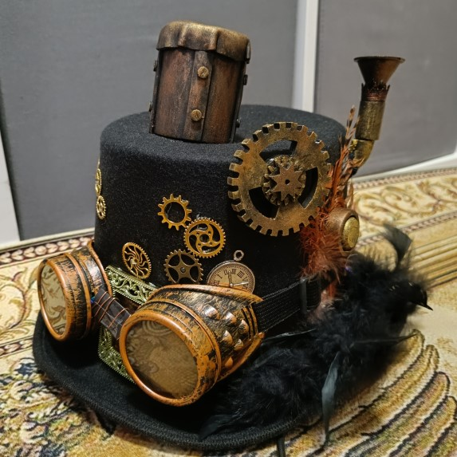
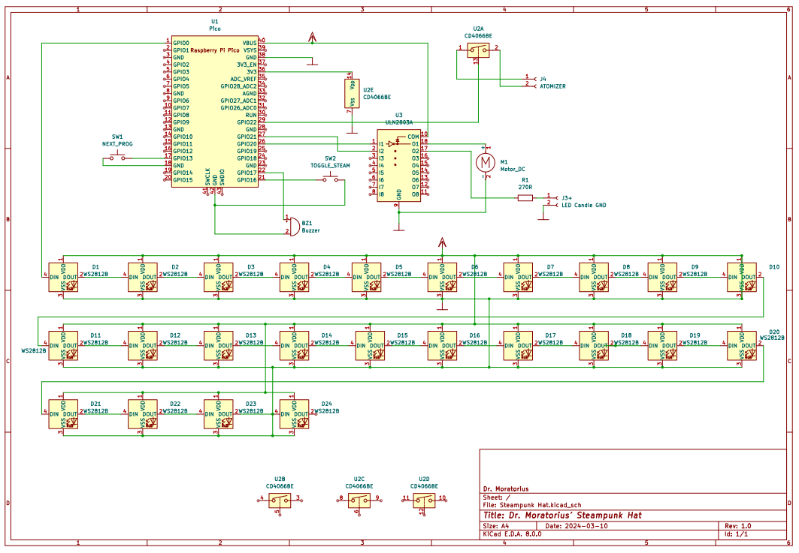
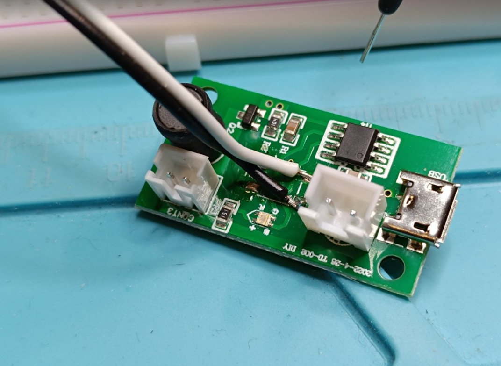
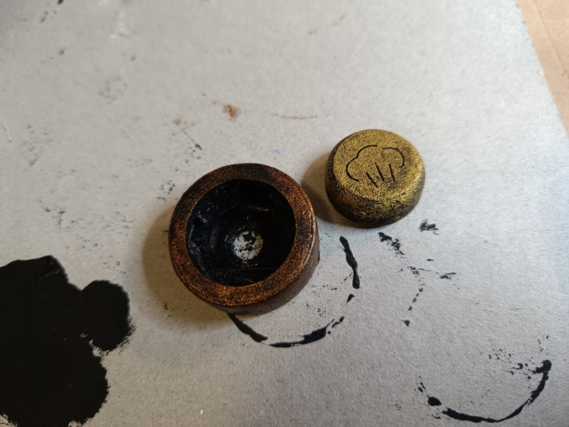
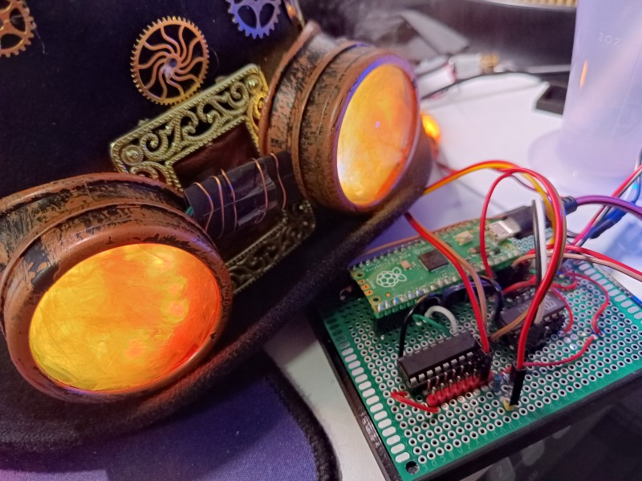
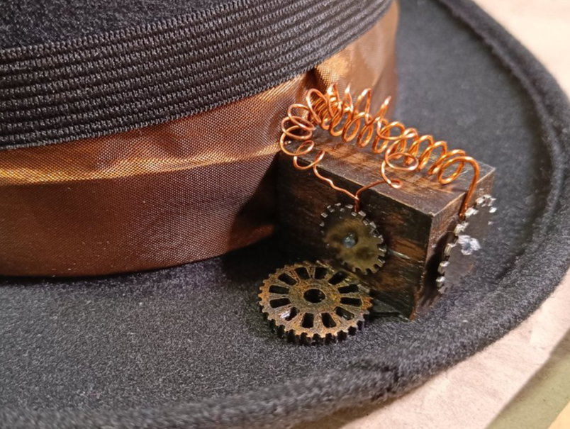
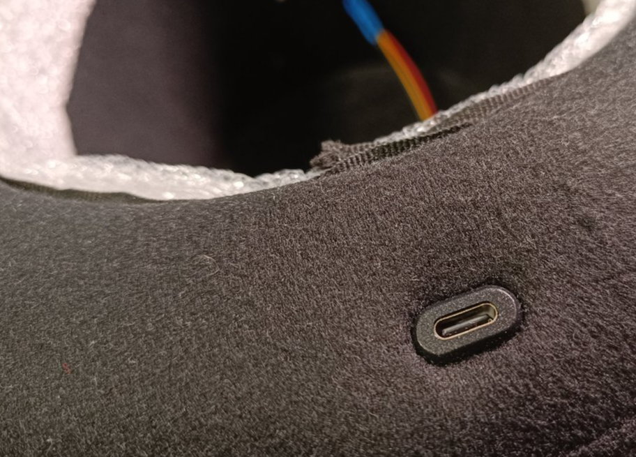
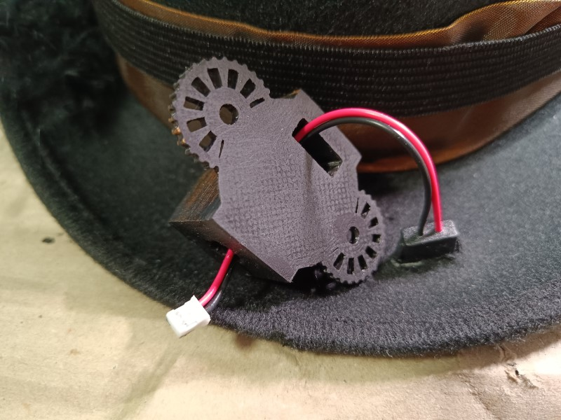

# Dr. Moratorius' Steampunk Hat

An interactive Steampunk hat with these features:
- Goggles with animated LEDs with different colors, changeable by button push on the side of the hat
- Atomizer that simulates steam coming out of the hat, can be turned on/off by button on the side of the hat
- A large cogwheel that turns every 10 seconds for three seconds
- Passive buzzer that beeps when pushing one of the two buttons indicating goggles color mode and steam on/off and when starting the hat 

This repository currently only contains all information on how to build the electronics.
This is not a tutorial on how to build it and is provided for reference only currently,
so you can at least benefit somewhat :)

## Parts
This is a list of parts including some sources for it.
* [Raspberry Pi Pico](https://www.raspberrypi.com/products/raspberry-pi-pico/)
* [CD4066 (CMOS)](https://www.ti.com/lit/ds/symlink/cd4066b.pdf)
* [ULN2803A](https://www.st.com/resource/en/datasheet/uln2804a.pdf)
* [2x Neopixel LED rings with 12 LEDs](https://www.amazon.de/gp/product/B07TZK9DNT/)
* [Passive Buzzer](https://www.amazon.de/EasyWordMall-10PCS-Passive-Buzzer-Widerstand/dp/B0179I6LIK/)
* [Hat](https://www.amazon.de/gp/product/B06XSGQHVM/)
* [Goggles](https://de.aliexpress.com/item/1005006185599783.html)
* [Candle LED](https://de.aliexpress.com/item/1005005445352883.html)
* [Atomizer](https://de.aliexpress.com/item/1005006471010039.html)
* [Atomizer Holder](https://de.aliexpress.com/item/1005005056005707.html)
* [N20 Motor - 60rpm](https://de.aliexpress.com/item/1005006213284700.html)
* [USB Adapter](https://de.aliexpress.com/item/1005005632352287.html)
* [PCB 70x90mm](https://de.aliexpress.com/item/1005006365975004.html)
* [2 x push buttons](https://www.gameroomguys.com/Red-Mini-Round-Momentary-Pushbutton-with-Nut-Washer)
* 3D-printed parts can be found in the [3D subdirectory](./3d)

## Schematic

[Full schematic](./Dr.%20Moratorius'%20Steampunk%20Hat%201.0%20-%20Schematic.pdf)

## Usage Notes
_WARNING_: When water is inside the reservoir the hat *must* be laid flat on a table or something similar
to prevent water leakage into the electronics etc.! When removing the hat you must not tilt it, but take it
off horizontally and lie it on a flat surface with the bottom on the surface, not vice versa!

Only use distilled water to prevent clogging of the atomizer.

It's best to soak the atomizer holder part thoroughly before inserting it because otherwise it might
take very long for it to soak in the water and start creating mist/fog. You should also prevent it from getting dry as this will
heat up the atomizer and requires a long new soaking time again.

## Technical Notes
* Uses an N20 motor enabled through the ULN2803A from an GPIO port
* Uses a CD4066 quad switch to "press" the button on the atomizer
  1. The atomizer features a physical button
  2. When the board receives power the LED turns red and nothing happens
  3. You have to physically press the button to switch to continuous mode (will produce mist and the on-board LED with alternate colors)
  3. When pressing on the button again it switches to interval mode (will produce mist for a few seconds, pause for a few seconds and start again)
  4. When pressing the button a third time you're back to start with the red LED where nothing happens
  5. This button has to be removed or at least cables to be placed correctly to be able to press the button digitally using the CD4066 switch
* The passive buzzer plays a short tune when the device is started, i.e. connected to power and beeps differently based on the current glasses color mode and atomizer setting
* The two buttons are capped with 3D-printed covers (see below), you can use any other button you like instead

### Atomizer
The atomizer features a physical button that has to be "pressed" via a GPIO pin using a 4066 switch:

### Buttons
The two buttons use specific button caps with [symbols](https://uxwing.com/) on it.

_Please note_: the hole in the button cap holder and the cap do not align correctly at the moment!
Alternatively, you could also use normal arcade buttons instead.

### Candle LED
The LED candle consists of several built-in LEDs to create a random flicker effect. These are powered
through a UNL2803A output via GPIO using a 270 ohm resistor.
[Candle LED info from bigclive](https://www.youtube.com/watch?v=4atbrGHLn1E)

### Board
All electronics are placed on a simple PCB and wired manually. Creating a printed circuit board
would of course also be possible, but I haven't done that because I only need one here. Feel free to do
that though! This photo does not show the final board (added more cables and parts).

### USB-C Connector
I also added a USB-C connector with a custom 3D printed part, however when using that USB port
for an unknown reason the device does not work correctly.

### Steam Chimney
The hat features a 3D-printed chimney covered by and decorated with foam rubber and painted using acrylic colors.
If features four holes:
* to stick the atomizer holder through it
* to stick the atomizer cable through it (might have to be enlarged)
* To stick two screws through it to connect to the reservoir inside the hat using nuts. 

### Water Storage
A funnel is connected to the reservoir inside using a small tube that is stuck through the hole
on the side of the reservoir. That way you can fill in distilled water.

Please note that the reservoir will automatically stop the hat from going any further on top of your
hat, so it definitely cannot rest on your ears anymore 😁

You could adapt the reservoir to make it smaller, but you'd also have to shorten the atomizer holder for that.

### Extensibility
As three switches in the 4066 and 6 outputs of ULN2803A are still unused you can extend it easily by connecting
more GPIOs and devices to it.

## Programming
The programming is done using JavaScript with [KalumaJS](https://kalumajs.org/) 
utilizing the packages [buzzer-music](https://github.com/niklauslee/buzzer-music) and 
[neopixel](https://github.com/niklauslee/neopixel).

### Flashing with KalumaJS
If you are not yet familiar with KalumaJS please see the [tutorial](https://kalumajs.org/docs/getting-started).
After setting up the firmware on the Raspberry Pi Pico open a new command prompt e.g. on Windows *with
administrative privileges*, enter the `src` directory and type this to bundle and flash the source code
onto the device:

`kaluma flash ./index.js --bundle --shell`

You can exit the shell by pressing `Ctrl+Z`.

## 3D Print
The `3D` directory contains all parts used. Please note this:
* Atomizer Board Holder: The two cylinders might have to be removed after printing if they don't fit
* Button & Holder: the circle is not perfectly centered on both parts which should be fixed - this might require scraping some part out after printing. I have to fix this sometime later.

## Known Inconveniences
For whatever reason when using the USB-C connector the device plays the start tune, but does not start the *full* program.
I currently have connected a micro USB connector directly to the Pico to power if from a powerbank instead.

### 3D Print Credits
* [Atomizer Reservoir - Bottle & Cap](https://www.thingiverse.com/thing:612709)
* [Steampunk Hat Chimney Top (Crown only)](https://www.thingiverse.com/thing:4573890)
* [Steampunk Hat Chimney](https://www.thingiverse.com/thing:3464045)
* [Button & Holder](https://www.thingiverse.com/thing:5078577)
* [Motor Holder](https://www.thingiverse.com/thing:2660688)
* [Large Cogwheel](https://www.thingiverse.com/thing:2730714)
